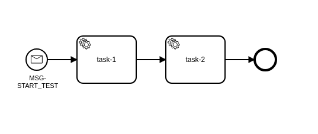

# Minimal Reproducer

## The issue

In a simple workflow:



Task 1 modifies the payload, then completes the job with it. Task 2 inspects the payload it gets to see if it has been modified.

Task 2's assertion fails inconsistently. Most of the time the payload has been modified as expected, but many times it has not.

## To Run

1. Install dependencies:
```bash
npm i
```
2. Start the Zeebe SNAPSHOT broker in Docker (see the note in the `broker/README.md`, if on Windows):
```bash
npm run broker:start
```
3. Deploy process:
```bash
npm run deploy
```
4. Start task workers. Both `reliable-worker` and `faulty-worker` show the fault:
```bash
npm start
```
5. Start 200 workflow instances:
```bash
COUNT=200 npm test
```

You may need to run through a few iterations, but faults will be reported by the task-2 worker, like this:

```bash
[[17:58:44.647]] [LOG]    [ task-2 4ab3caae-e14d-47cc-9d34-8a454a293eb9 ] > Iteration 1163 - key1 not modified
[[17:58:44.647]] [LOG]    [ task-2 4ab3caae-e14d-47cc-9d34-8a454a293eb9 ] > Iteration 1163 - key2 not added
[[17:58:44.647]] [LOG]    [ task-2 4ab3caae-e14d-47cc-9d34-8a454a293eb9 ] > Fault Count: 139/1163
[[17:58:44.647]] [LOG]    [ task-2 4ab3caae-e14d-47cc-9d34-8a454a293eb9 ] > Iteration 1164 - key1 not modified
[[17:58:44.647]] [LOG]    [ task-2 4ab3caae-e14d-47cc-9d34-8a454a293eb9 ] > Iteration 1164 - key2 not added
[[17:58:44.648]] [LOG]    [ task-2 4ab3caae-e14d-47cc-9d34-8a454a293eb9 ] > Fault Count: 140/1164
[[17:58:45.041]] [LOG]    [ task-2 4ab3caae-e14d-47cc-9d34-8a454a293eb9 ] > Iteration 1200 - key1 not modified
[[17:58:45.042]] [LOG]    [ task-2 4ab3caae-e14d-47cc-9d34-8a454a293eb9 ] > Iteration 1200 - key2 not added
[[17:58:45.042]] [LOG]    [ task-2 4ab3caae-e14d-47cc-9d34-8a454a293eb9 ] > Fault Count: 141/1200
```

## Inspecting payload passed out of Task 1

Uncomment line 33 in `src/worker.ts` and start the workers with `npm run debug`. This will log the payload being passed to the gRPC methods, and halt on the first error.